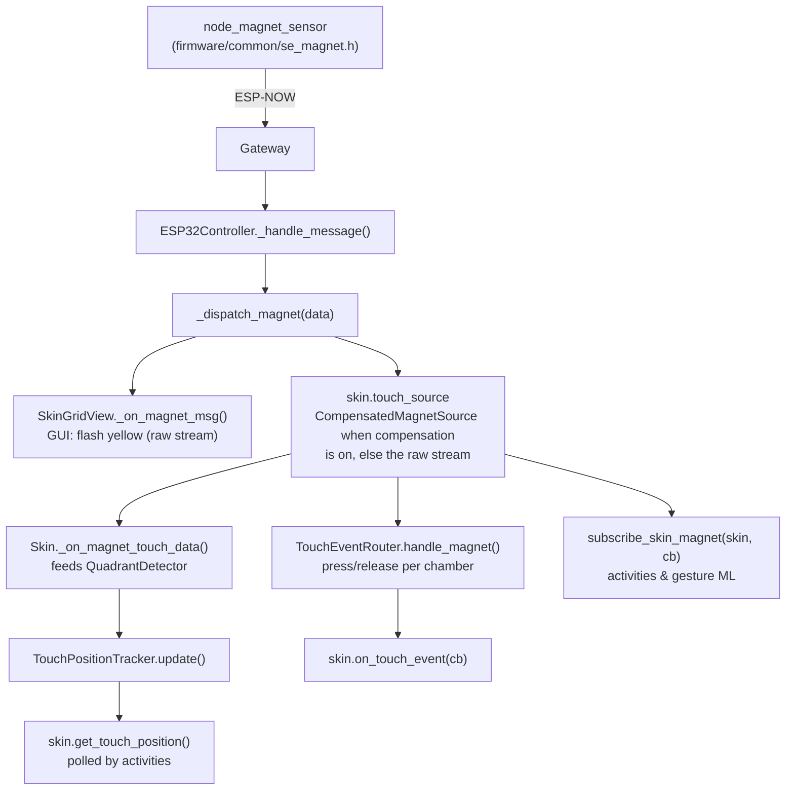

# Touch Sensing - Design & Implementation

> This doc covers the **magnetic** sensing path (physics + detection). For the
> abstraction that lets a *different* sensor technology (e.g. capacitive) be
> plugged in, see [TOUCH_SENSORS.md](TOUCH_SENSORS.md).

## Physical Design

Each skin that has touch sensing is built as a layered stack:

```
[ user ]
-------------------------------
  silicone skin with chambers     <- pneumatic layer, inflates toward user
-------------------------------
  silicone layer
-------------------------------
  magnets in  grid;
  encapsulated in silicone
-------------------------------
  silicone layer
-------------------------------
  MLX90393 sensors
-------------------------------
[ rigid plastic / PCB (node_magnet_sensor) ]
```

**How touch detection works:**  
When the user presses a chamber, the silicone compresses and the magnet above
that chamber moves closer to its sensor -> the sensor reading increases above the
resting baseline -> touch detected on that chamber.

**Chamber actuation can contaminate touch detection:**  
Inflating a chamber deforms the silicone too, so it can shift a magnet and
masquerade as a touch.  How much depends on the build - measure it per skin
(Tools -> Calibrate Touch Coupling...) and, where it bites, enable the
pressure-informed compensation and/or the firmware's opt-in adaptive baseline.
See [TOUCH_COUPLING.md](TOUCH_COUPLING.md); the detection path described below
consumes the *compensated* stream whenever compensation is enabled.

Each sensor maps 1-to-1 to one chamber by default; the routing is configurable
per skin (see *Sensor-to-chamber mapping* below).

---

## Software Architecture

### Key files

| File | Role |
|------|------|
| `src/hardware/quadrant_detector.py` | Signal processing - absolute uT thresholds + Schmitt-trigger hysteresis per sensor, position estimation from active sensors |
| `src/hardware/skin.py` | Builds the (optionally compensated) `touch_source`, feeds the detector, exposes `get_touch_position()` + the live tuning API |
| `src/hardware/touch_source.py` | `CompensatedMagnetSource` + `subscribe_skin_magnet` - the single entry point for detection consumers |
| `src/hardware/touch_event_router.py` | Edge-detects the `act` set into per-chamber press/release events (`skin.on_touch_event`) |
| `src/hardware/skin_geometry.py` | Per-skin-type shape + sensor coordinates - drives the GUI sensor layout |
| `src/gui/monitor/skin_grid_view.py` | GUI - yellow pulse on the cells of each active sensor |
| `src/gui/monitor/touch_tuning_panel.py` | Live threshold/hysteresis tuning, sensor re-zero, adaptive-baseline toggle |

### Data flow



### magnet sensor message format

The `node_magnet_sensor` firmware (shared module `firmware/common/se_magnet.h`,
also folded into the direct actuator board) streams at ~28 Hz via ESP-NOW:

```json
{"type": "magnet", "mag": [4.0, 180.0, 6.0, 3.0], "act": [1], "source": "AA:BB:CC:DD:EE:FF"}
```

| Field | Description |
|-------|-------------|
| `mag` | Per-sensor field-change magnitudes in uT, baseline-subtracted by the firmware |
| `act` | Indices of sensors whose `mag` is at/above the firmware threshold (`act_threshold_ut`, default 300 uT) |
| `vec` | Optional per-sensor 3-axis deltas `[[dx,dy,dz], ...]` (uT) when vector streaming is on (`{"cmd":"configure","stream_vec":true}` or the `MAG_VECTOR` build) - feeds vector compensation and the gesture ML's direction features |

Each sensor auto-zeros over its first 70 reads at boot; `{"cmd":"rebaseline"}`
re-zeros at runtime and `{"cmd":"configure",...}` tunes `act_threshold_ut`,
`adaptive_baseline`/`baseline_tau_ms` and `stream_vec`.  Sensor order is wiring
order: S0-S3 map to quadrants Q1(TL) Q2(TR) Q3(BL) Q4(BR); an optional 5th
sensor is appended after them.  At boot the board announces
`{"status":"node_magnet_sensor_ready","sensors":N,"variant":"mlx90393"}`
(+`"vec":1` when vector streaming is on), which `ESP32Controller` caches as
`magnet_geometry`.  In simulation a `SimulatedMagnetSensor` emits the same
messages with a `sim:` source, so recordings stay honest about synthetic data.

`Skin._extract_sensor_magnitudes()` tries `mag` -> `act` in order, so it works on
the raw uT magnitudes and falls back to the binary active set.

---

## Sensor-to-chamber mapping

**The routing lives in the skin's `touch:` block** as `sensor_to_chamber` -
which skin-local chamber a touch on sensor N drives.  It defaults to 1:1
(sensor N -> chamber N, capped at `min(chambers, sensor_count)`) and is
hand-authored in the YAML; the skin config dialog preserves it on save but does
not edit it.

Two consumers resolve it the same way:

- `TouchEventRouter` (`src/hardware/touch_event_router.py`) edge-detects the
  `act` set on the compensated stream and emits
  `callback(chamber_id, "press"|"release")` via `skin.on_touch_event` -
  chamber-level touch events for any consumer.
- The behavior engine (`ScriptedActivity._touch_mapping`) uses it to keep
  per-chamber touch counters, so `wait_for_touch` steps and `touch_count`
  conditions can target a specific chamber.

### Sensor layout (GUI) vs `sensor_to_chamber` (routing)

| Property | Where | Purpose |
|----------|-------|---------|
| sensor coordinates | `src/hardware/skin_geometry.py`, keyed by `skin_type` | Visual: which cells flash yellow in `SkinGridView` when sensor N fires.  Skins without a `skin_type` fall back to a legacy `sensor_grid` in the `touch:` block (no longer written by the skin dialog). |
| `sensor_to_chamber` | skin `touch:` block | Logic: which chamber a touch on sensor N drives |

---

## Configuration reference

Full example (add inside a skin entry in `config/settings.yaml`):

```yaml
touch:
  node_mac: "BB:CC:DD:EE:FF:00"   # MAC of the touch node for this skin
  sensor_count: 4                  # must match number of sensors on the board

  # Routing (optional): sensor index -> skin-local chamber. Default 1:1.
  sensor_to_chamber: {"0": 0, "1": 1, "2": 2, "3": 3}

  # Detection tuning (all optional; raw uT units)
  quadrant_thresholds: [100, 100, 100, 100]  # per-sensor activation, uT
  hysteresis: 20                    # uT below threshold before deactivation
  ema_alpha: 0.25                   # EMA for the displayed sensor values
  position_smoothing: 0.3           # confidence EMA factor, higher = faster
  min_touch_duration_ms: 100        # ignore taps shorter than this

  # Written by Tools -> Calibrate Touch Coupling... (see TOUCH_COUPLING.md):
  # coupling: {...}                 # measured chamber->sensor offset curves
  # compensation: {enabled: true, threshold_ut: 300, ...}
```

### Parameter reference

| Parameter | Default | Notes |
|-----------|---------|-------|
| `node_mac` | required | MAC of the touch node - a `node_magnet_sensor`, or a `node_direct` that folds the magnet module in |
| `sensor_count` | 4 | Quadrant position tracking only engages at exactly 4 sensors; skins with fewer still get touch events |
| `sensor_to_chamber` | 1:1 | Sensor -> chamber routing (see the section above) |
| `quadrant_thresholds` | `[100, ...]` uT | One threshold per sensor; lower = more sensitive.  Tune live in the Touch tuning panel |
| `hysteresis` | `20` uT | Band below threshold before deactivation |
| `ema_alpha` | `0.25` | Display smoothing for the sensor values |
| `position_smoothing` | `0.3` | 1.0 = no smoothing, 0.0 = maximum smoothing |
| `min_touch_duration_ms` | `100` | Filter accidental brief contacts |
| `coupling`, `compensation` | - | Written by the coupling calibration tool ([TOUCH_COUPLING.md](TOUCH_COUPLING.md)) |
| `grid`, `sensor_grid` | legacy | Visual fallback for skins without a `skin_type`; typed skins draw from the geometry registry |

---

## API

### `skin.get_touch_position() -> dict`

Returns the current touch state.  Call this from an activity on each tick.

```python
state = skin.get_touch_position()

# state keys:
# "enabled"          bool  - False if no 4-sensor touch: block configured
#                            (then only enabled/position/zone/confidence exist)
# "is_touching"      bool  - at least one sensor above threshold
# "is_valid_touch"   bool  - touch duration >= min_touch_duration_ms
# "position"         str   - e.g. "Q1", "Q1-Q2", "CENTER", "NONE"
# "zone"             str   - e.g. "top_left", "top_edge", "center", "none"
# "confidence"       float - 0.0-1.0
# "touch_duration_ms" int  - ms since touch started (0 if not touching)
```

### `skin.has_touch_tracking -> bool`

True when the skin's `touch:` block has exactly 4 sensors and the
`QuadrantDetector` was initialised successfully.  Skins with fewer sensors skip
position tracking but still get touch events (`on_touch_event`) and the
raw/compensated stream.

### `skin.reset_touch_tracking()`

Resets internal hysteresis and timing state (e.g. between activity rounds).

### `skin.on_magnet(callback) -> bool`

Subscribes to the skin's **compensated** magnet stream (the raw controller
stream when compensation is off).  Prefer the module helper
`subscribe_skin_magnet(skin, callback)` (`src/hardware/touch_source.py`), which
falls back to the raw controller for objects that predate `on_magnet`.

### `skin.on_touch_event(callback)`

`callback(chamber_id, "press"|"release")` per chamber, routed through
`touch.sensor_to_chamber`.  Callbacks fire on the gateway thread - marshal to
the GUI thread before touching Qt.

### Live tuning

`skin.touch_thresholds` / `set_touch_thresholds()` and `skin.touch_hysteresis`
/ `set_touch_hysteresis()` adjust the detector at runtime (uT);
`rebaseline_touch()` re-zeros the node's sensors over ESP-NOW and resets local
tracking.  The Touch tuning panel under the skin grid view drives these -
changes are runtime-only; copy good values into the `touch:` block to keep
them.

---

## Activity integration

Activities are behavior-engine scripts (`ScriptedActivity`); touch reaches
them three ways:

- **Blocks:** `wait_for_touch` steps (optionally per chamber) and `touch_count`
  conditions - per-chamber counters resolve through `touch.sensor_to_chamber`.
- **Chamber events:** `skin.on_touch_event(lambda chamber_id, action: ...)` for
  press/release per chamber (fires on the gateway thread).
- **Raw stream:** `subscribe_skin_magnet(skin, callback)`
  (`src/hardware/touch_source.py`) - the compensated `magnet` messages, the
  same stream the gesture ML consumes.

`get_touch_position()` is useful when you want the zone name
(`"top_left"`, `"center"`, ...) rather than raw sensor indices:

```python
state = skin.get_touch_position()
if state["is_valid_touch"]:
    logger.info("Touch at %s for %d ms", state["zone"], state["touch_duration_ms"])
```

---

## GUI

`SkinGridView` shows touch feedback using the existing yellow pulse:

- When a sensor fires (appears in `act`), the cells for that sensor flash with
  a yellow outline.
- The pulse decays over ~400 ms; while touching continuously it stays lit.
- No separate indicator is drawn - the yellow cells directly show which
  chamber is being pressed.

The layout of the highlighted cells comes from the skin type's geometry
registry (`skin_geometry.py`); legacy type-less skins fall back to a
`sensor_grid` in the YAML.  Any skin shape (rectangular, round, asymmetric) is
supported.  In simulation, per-sensor "T" buttons fire the same code path
through the `SimulatedMagnetSensor`.

---

## Troubleshooting

| Symptom | Likely cause | Fix |
|---------|--------------|-----|
| No touch detected | Baseline still settling, or threshold too high | Wait for the boot auto-zero (~70 reads), press **Re-zero sensors**, lower `quadrant_thresholds` (uT) |
| Constant false positive | Threshold too low, magnet too strong, or a chamber inflated under the sensor | Raise the threshold; if actuation-related, calibrate coupling ([TOUCH_COUPLING.md](TOUCH_COUPLING.md)) |
| Flickering on/off | Sensor noise at edge of threshold | Increase `hysteresis` (try 30-50 uT) |
| Wrong chamber reacts | `touch.sensor_to_chamber` mapping wrong | Check sensor physical positions and update the mapping |
| No yellow flash in GUI | `node_mac` mismatch or magnet node not connected | Verify the MAC in config matches the node_magnet_sensor |

---

## Source reference

| Component | Origin |
|-----------|--------|
| `QuadrantDetector` / `TouchPositionTracker` | Adapted from the thesis QuadrantPredictor (`tools/quadrant_live_plot.py`) |
| magnet sensor firmware | In-tree: `firmware/node_magnet_sensor/` on the shared `firmware/common/se_magnet.h` module (also folded into the direct actuator board) |
| `Skin._extract_sensor_magnitudes` | Handles the `mag`/`act` fallback chain |
| `SkinGridView` yellow pulse | Pre-existing, unchanged |
